# PERX

**PERX** is a modern employee benefits marketplace built for Albania and designed to scale across Europe.

The platform connects **employees**, **employers**, and **service providers** in one benefits ecosystem. Companies fund employee benefit credit, employees choose the benefits they actually want, and local providers receive verified redemptions through QR tickets and benefit codes.

PERX was built for the **JunctionX Tirana / TeamSystem challenge**.

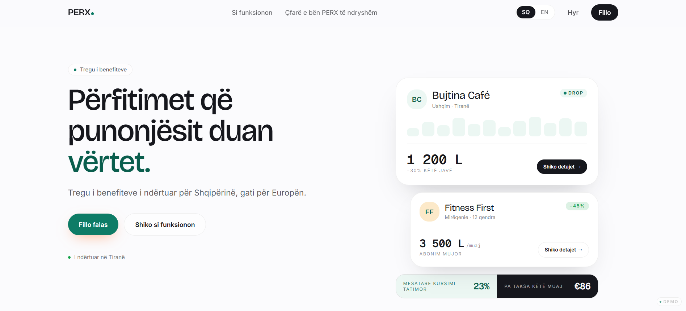

---

## Table of Contents

- [Live Demo](#live-demo)
- [Core Idea](#core-idea)
- [Problem](#problem)
- [Solution](#solution)
- [Main Roles](#main-roles)
- [Demo Routes](#demo-routes)
- [Demo Accounts](#demo-accounts)
- [Run Locally](#run-locally)
- [Build Locally](#build-locally)
- [Environment Variables](#environment-variables)
- [Project Structure](#project-structure)
- [Tech Stack](#tech-stack)
- [Landing Page](#landing-page)
- [Authentication](#authentication)
- [Employee Experience](#employee-experience)
- [AI Benefits Concierge](#ai-benefits-concierge)
- [Employer Experience](#employer-experience)
- [Provider Experience](#provider-experience)
- [Recommended Demo Flow](#recommended-demo-flow)
- [Current MVP Scope](#current-mvp-scope)
- [Future Improvements](#future-improvements)

---

## Live Demo

The PERX demo is available here:

**Demo:** https://project-7xnzk.vercel.app

Use the demo accounts below to test the employee, employer, and service provider flows.

---

## Core Idea

PERX turns employee benefits into a marketplace.

Instead of giving employees generic perks or only salary increases, a company gives them benefit credit. Employees can then use that balance to select offers from local providers such as gyms, restaurants, learning centers, clinics, telecom providers, travel agencies, wellness studios, and retail partners.

The current MVP focuses on Albania with:

- Albanian-first interface
- Albanian Lek pricing
- Albanian provider examples
- Albania map coverage
- Employer budget management
- QR-based redemption
- AI-powered benefit recommendations
- Employee gifting
- Tax-saving comparisons

---

## Problem

Employee benefits are often underused because they are not personal, not easy to redeem, and not clearly connected to real employee needs.

Companies also have limited tools to understand what their team actually wants. Service providers, on the other hand, do not have a simple way to access company-funded demand.

PERX solves this by making benefits:

- easier to discover
- easier to redeem
- easier to manage
- easier to measure
- more personal for employees
- more useful for employers
- more accessible for local service providers

---

## Solution

PERX provides one platform for the full benefit lifecycle:

1. The employer funds benefit credit for employees.
2. Employees browse or ask the AI concierge for recommendations.
3. Employees select benefits, packages, or gifts.
4. Employers can approve requests and track spending.
5. Providers validate QR tickets or manual codes.
6. PERX shows usage, spending, and category insights.

---

## Main Roles

### 1. Employee

Employees use PERX to browse, select, redeem, and gift benefits.

Main employee features:

- Benefit wallet
- Spending progress
- New offers
- Personalized recommendations
- Marketplace categories
- Smart packages
- AI benefits concierge
- Tax-saving calculator
- Map of provider locations
- My benefits page
- QR ticket redemption
- Gift points
- Gift packages

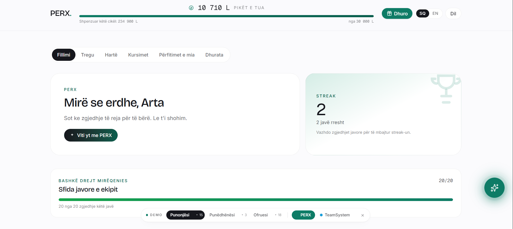

---

### 2. Employer

Employers use PERX to manage the company benefit program.

Main employer features:

- Budget overview
- Spending overview
- Pending approvals
- Employee management
- Point allocation
- Recent activity tracking
- Benefit category analytics
- Savings calculator

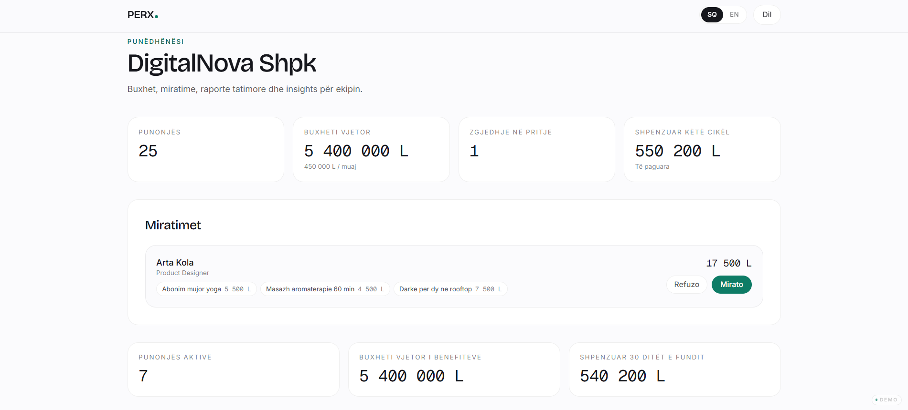

---

### 3. Service Provider

Providers use PERX to publish offers and verify employee redemptions.

Main provider features:

- Provider dashboard
- Monthly revenue overview
- Active confirmations
- Offer management
- Demand overview
- Used tickets history
- QR ticket scanning
- Manual ticket verification

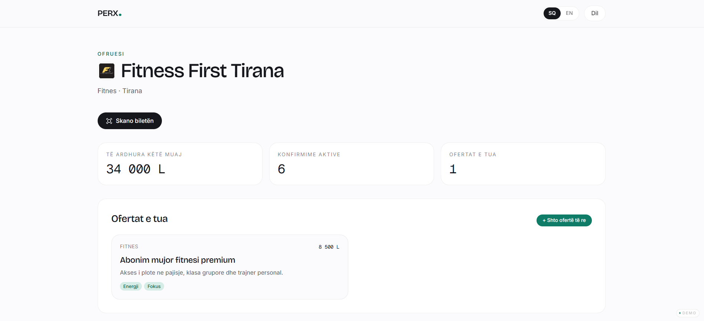

---

## Demo Routes

The main demo routes are:

```txt
/                 Landing page
/auth             Login and registration
/app/employee     Employee experience
/app/employer     Employer dashboard
/app/provider     Service provider dashboard
```

The demo also includes a floating role switcher so the presenter can quickly move between employee, employer, and provider views.

---

## Demo Accounts

The demo switcher uses the following password for all demo accounts:

```txt
DemoPerx!2026
```

### Employee Demo Accounts

```txt
arta.k@perx.al
besnik.h@perx.al
eliona.s@perx.al
endrit.k@digitalnova.al
klejda.m@digitalnova.al
edon.b@adriatikbank.al
ilirjana.d@adriatikbank.al
genc.h@adriatikbank.al
mirela.c@adriatikbank.al
florian.b@adriatikbank.al
anila.k@adriatikbank.al
driton.v@kafeflora.al
suela.m@kafeflora.al
klara.b@kafeflora.al
rinor.h@kafeflora.al
```

### Employer Demo Accounts

```txt
demo.employer@perx.al
admin@adriatikbank.al
admin@kafeflora.al
```

### Provider Demo Accounts

```txt
prov1@perx.al
prov2@perx.al
prov3@perx.al
prov4@perx.al
prov5@perx.al
prov6@perx.al
prov7@perx.al
prov8@perx.al
prov9@perx.al
prov10@perx.al
prov11@perx.al
prov12@perx.al
prov13@perx.al
prov14@perx.al
prov15@perx.al
prov16@perx.al
prov17@perx.al
prov18@perx.al
```

---

## Run Locally

This project runs with Node.js and npm.

Tested locally with:

```txt
Node.js: v22.16.0
npm: 10.9.2
```

Install dependencies:

```bash
npm install
```

Start the local development server:

```bash
npm run dev
```

The app normally starts on:

```txt
http://localhost:8080
```

If port `8080` is already used, Vite will automatically use another port. Use the URL printed in the terminal.

To force a specific port:

```bash
npm run dev -- --host 127.0.0.1 --port 8099
```

To expose it on the local network:

```bash
npm run dev -- --host 0.0.0.0
```

---

## Build Locally

Create a production build:

```bash
npm run build
```

Preview the production build:

```bash
npm run preview
```

To preview on a specific port:

```bash
npm run preview -- --host 127.0.0.1 --port 8100
```

---

## Environment Variables

The repository includes a `.env` file for the demo. It is required for Supabase, maps, and connected demo data.

Current required variables:

```env
SUPABASE_PROJECT_ID=
SUPABASE_PUBLISHABLE_KEY=
SUPABASE_URL=
VITE_LOVABLE_CONNECTOR_GOOGLE_MAPS_BROWSER_KEY=
VITE_LOVABLE_CONNECTOR_GOOGLE_MAPS_TRACKING_ID=
VITE_SUPABASE_PROJECT_ID=
VITE_SUPABASE_PUBLISHABLE_KEY=
VITE_SUPABASE_URL=
```

For the submitted demo build, keep the provided `.env` file in place.

Supabase Edge Functions may also require server-side secrets when deployed through Supabase:

```env
GEMINI_API_KEY=
SUPABASE_SERVICE_ROLE_KEY=
SUPABASE_ANON_KEY=
```

These are used by the Supabase functions under:

```txt
supabase/functions/concierge
supabase/functions/voucher-sign
supabase/functions/voucher-verify
```

---

## Project Structure

```txt
perx-foundation/
├── .env
├── package.json
├── package-lock.json
├── vite.config.ts
├── tsconfig.json
├── src/
│   ├── assets/
│   │   └── providers/
│   ├── components/
│   │   ├── ui/
│   │   ├── app-shell.tsx
│   │   ├── concierge-launcher.tsx
│   │   ├── concierge-panel.tsx
│   │   ├── demo-role-switcher.tsx
│   │   ├── employer-team-panel.tsx
│   │   ├── gift-modal.tsx
│   │   ├── offer-detail-modal.tsx
│   │   ├── perx-map.tsx
│   │   ├── provider-scan-modal.tsx
│   │   ├── voucher-modal.tsx
│   │   └── year-in-benefits.tsx
│   ├── hooks/
│   ├── integrations/
│   │   ├── lovable/
│   │   └── supabase/
│   ├── lib/
│   │   ├── concierge-fallback.ts
│   │   ├── i18n.ts
│   │   ├── pricing.ts
│   │   ├── tax-savings.ts
│   │   ├── use-gifts.ts
│   │   ├── use-marketplace.ts
│   │   ├── use-profile.ts
│   │   ├── use-team.ts
│   │   └── use-vouchers.ts
│   ├── routes/
│   │   ├── index.tsx
│   │   ├── auth.tsx
│   │   └── _authenticated/
│   │       ├── app.employee.tsx
│   │       ├── app.employer.tsx
│   │       ├── app.provider.tsx
│   │       ├── join.tsx
│   │       └── onboarding.tsx
│   ├── router.tsx
│   ├── server.ts
│   ├── start.ts
│   └── styles.css
├── supabase/
│   ├── config.toml
│   ├── functions/
│   │   ├── concierge/
│   │   ├── voucher-sign/
│   │   └── voucher-verify/
│   └── migrations/
└── docs/
    └── screenshots/
```

---

## Tech Stack

PERX is built with:

- React 19
- TypeScript
- Vite
- TanStack Start
- TanStack Router
- TanStack Query
- Supabase
- Supabase Edge Functions
- Tailwind CSS 4
- Radix UI
- Lucide React
- QR Scanner
- QR Code generation
- Google Maps integration
- jsPDF / html2canvas for receipt-style exports
- Gemini through Supabase Edge Function for the AI concierge

---

## Landing Page

The landing page introduces PERX as a benefits marketplace built for Albania.

Main message:

```txt
Përfitimet që punonjësit duan vërtet.
```

The page includes:

- PERX branding
- Albanian / English toggle
- Login button
- Start button
- Example benefit cards
- Provider examples
- Tax-saving preview


---

## Authentication

The authentication page supports login and registration.

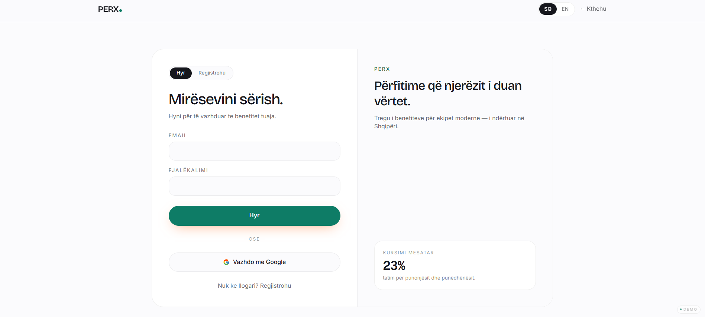

During registration, users select a role:

- Employee
- Business — Employer
- Business — Service Provider

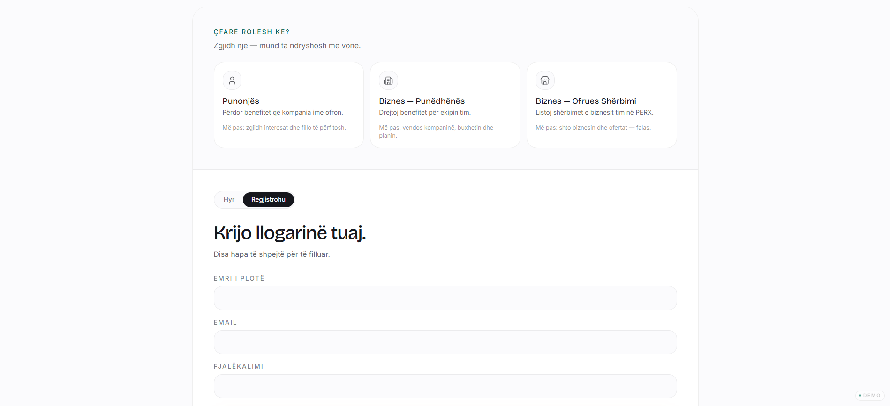

---

## Employee Experience

The employee experience shows how a user can spend company-funded benefit credit.

### Employee Home

The employee home page shows:

- Current balance
- Spending progress
- Weekly challenge
- Streak card
- Navigation tabs
- Gift button
- Floating AI concierge launcher


---

### New Offers

The new offers section highlights limited-time benefits.

Example offers:

- Workshop weekend yoga
- Kurs anglisht 8 javë
- Italisht intensiv 4 javë

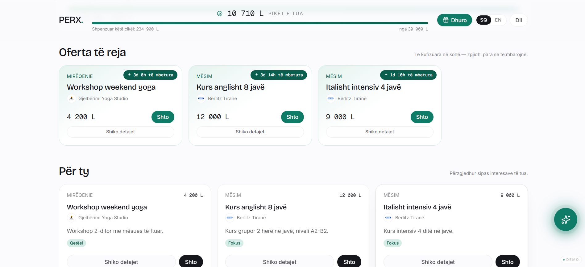

---

### Smart Packages

Smart packages combine several benefits into one bundle.

Examples:

- Java e Mirëqenies
- Paketa e Fokusit
- Arratisja e Fundjavës

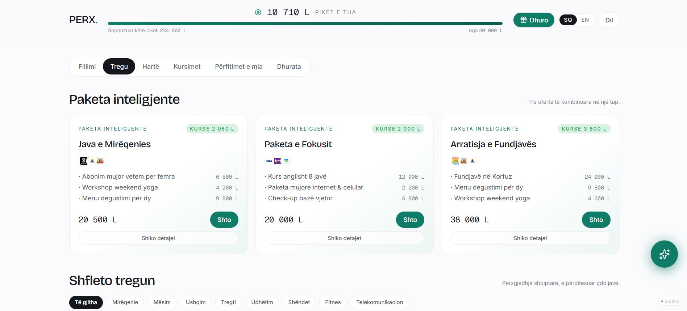

---

### Marketplace

Employees can browse the marketplace by category.

Categories include:

- Mirëqenie
- Mësim
- Ushqim
- Tregti
- Udhëtim
- Shëndet
- Fitnes
- Telekomunikacion

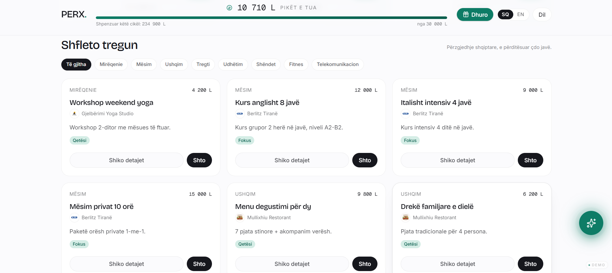

---

### Map View

The map view shows where benefits can be used in Albania.

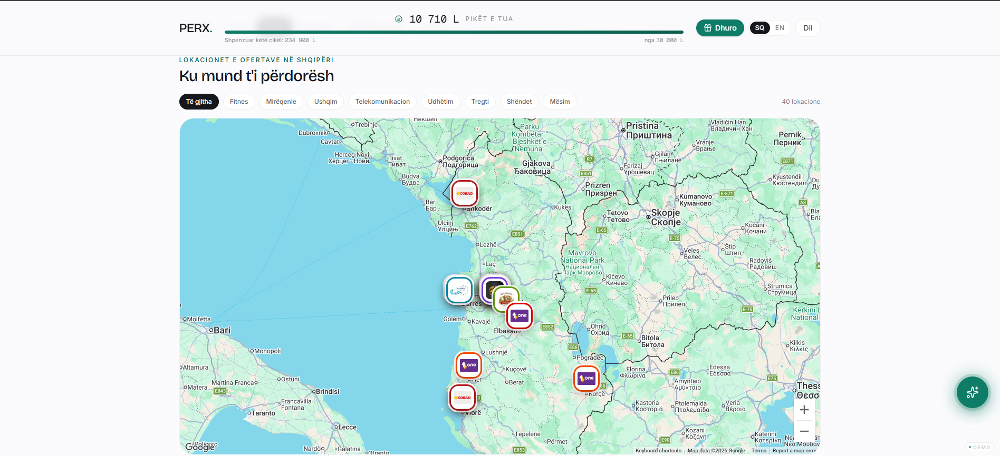

The map supports category filtering and shows provider locations visually.

---

### Savings Calculator

PERX explains why benefits can be more valuable than a normal salary equivalent.

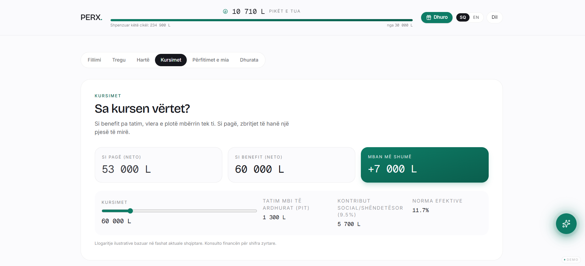

Example shown:

```txt
Net salary: 53,000 L
Net benefit: 60,000 L
Extra kept: +7,000 L
Effective rate: 11.7%
```

---

### My Benefits

The employee can view selected and redeemed benefits.

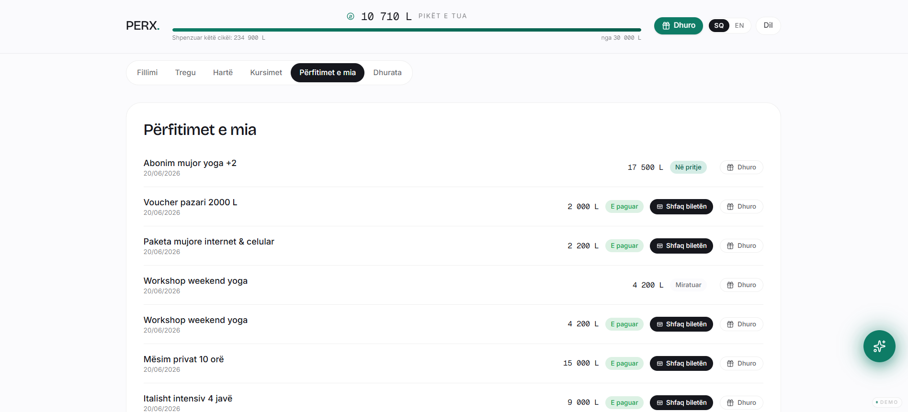

Each item includes:

- Benefit name
- Date
- Value
- Status
- Ticket button
- Gift button

---

### QR Ticket

Redeemed benefits can generate a QR ticket.

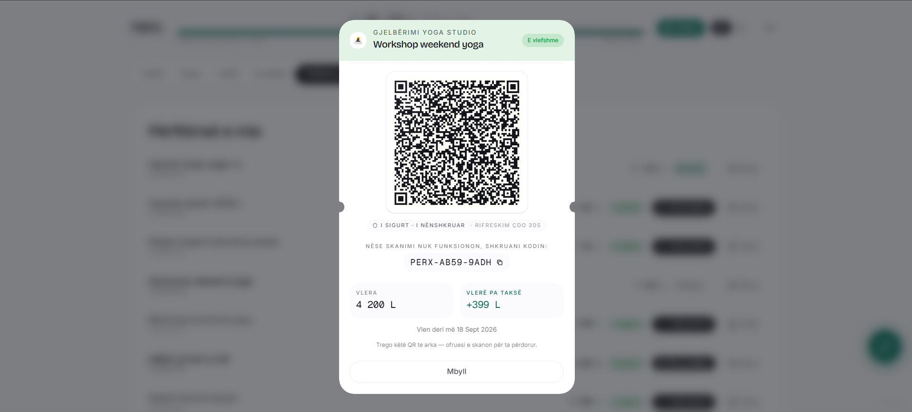

The ticket includes:

- Provider name
- Benefit name
- QR code
- Manual code
- Value
- Tax-free value
- Expiry date

Example code format:

```txt
PERX-AB59-9ADH
```

---

### Gifts

Employees can gift points or benefit packages to colleagues.

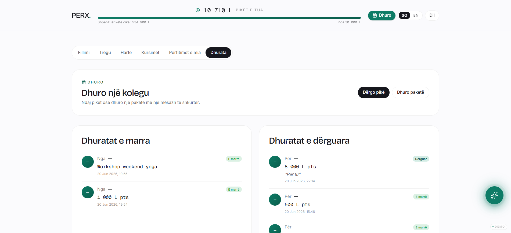

Send points:

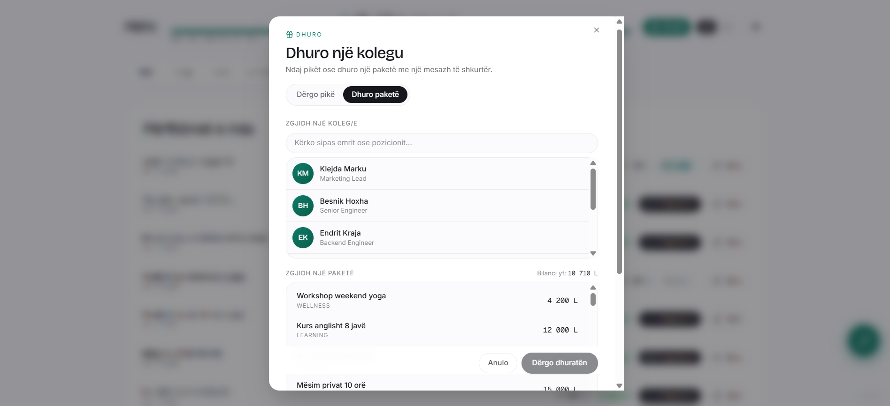

Send package:

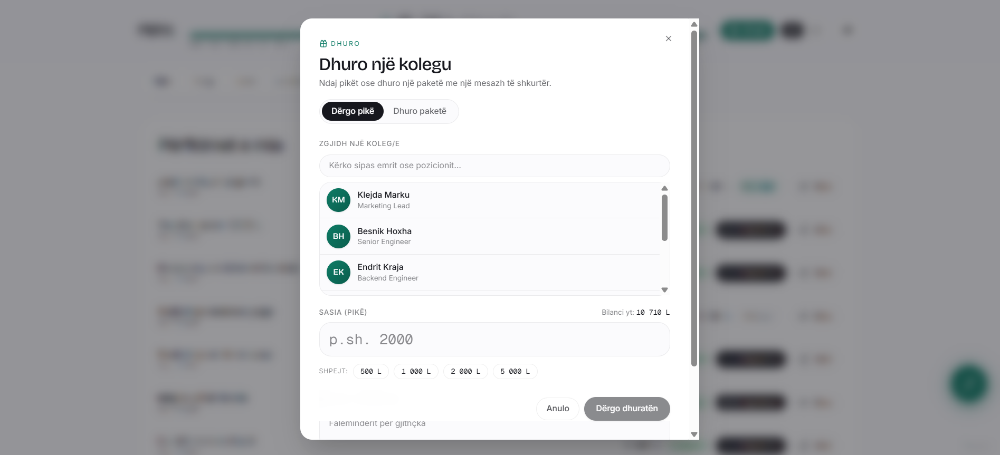

---

### Offer Details

Each benefit has a detailed modal with description, provider, price, and tax-saving explanation.

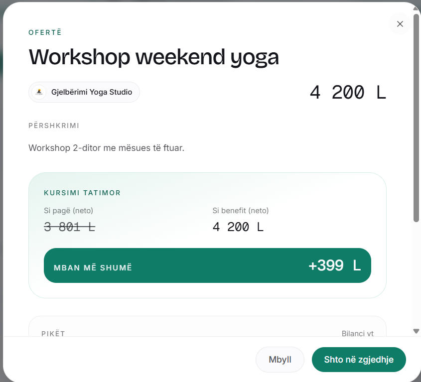

Example:

```txt
Offer: Workshop weekend yoga
Provider: Gjelbërimi Yoga Studio
Price: 4,200 L
Extra kept as benefit: +399 L
```

---

## AI Benefits Concierge

PERX includes an AI-powered benefits concierge.

The concierge helps employees find benefits by describing what they need instead of manually searching the marketplace.

Example prompt:

```txt
Energji & fokus për javën e punës
```

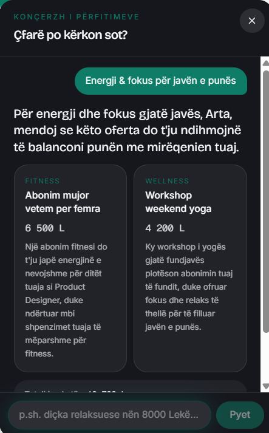

Example AI recommendation:

```txt
Për energji dhe fokus gjatë javës, Arta, mendoj se këto oferta do t'ju ndihmojnë të balanconi punën me mirëqenien tuaj.
```

The concierge can recommend benefits such as:

- Abonim mujor vetëm për femra
- Workshop weekend yoga

It can also generate a ready-made package.

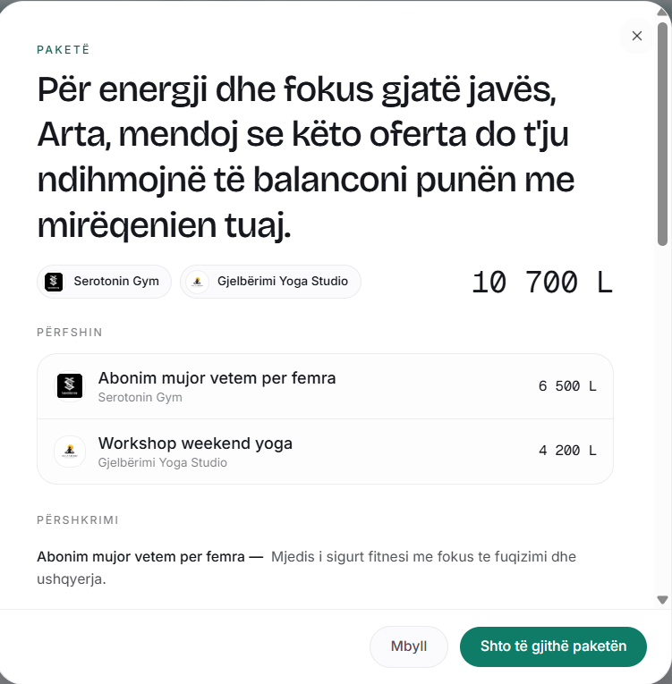

Example AI package value:

```txt
10,700 L
```

The package location modal shows where the benefits can be used.

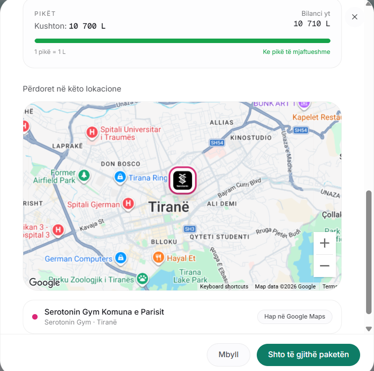

---

## Employer Experience

The employer dashboard gives the company control over budgets, employees, approvals, and usage insights.

Demo employer:

```txt
DigitalNova Shpk
```


Dashboard values shown in the demo:

```txt
Employees: 25
Yearly budget: 5,400,000 L
Pending selections: 1
Spent this cycle: 550,200 L
```

---

### Team Management

Employers can manage employees and allocate points.

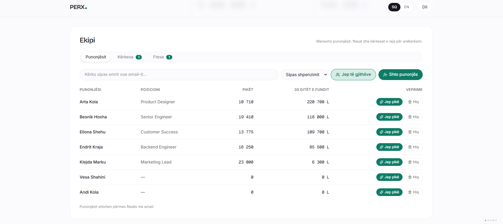

The team page includes:

- Employee list
- Position
- Current points
- Last 30 days spending
- Search
- Sorting
- Give points button
- Add employee button
- Give points to everyone button

---

### Analytics and Savings

Employers can see which categories employees choose most and compare benefit cost against salary-increase cost.

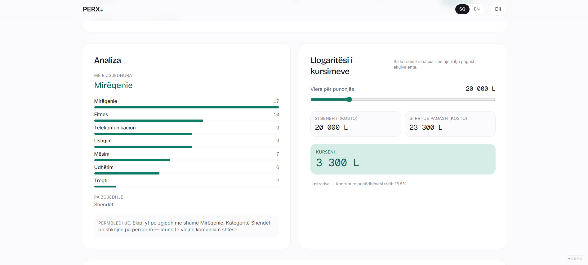

Example savings comparison:

```txt
Value per employee: 20,000 L
As benefit cost: 20,000 L
As salary increase cost: 23,300 L
Saved: 3,300 L
```

---

### Recent Activity

Employers can monitor employee benefit activity.

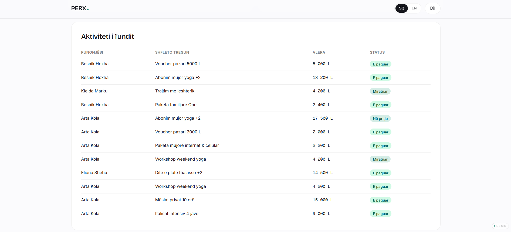

The activity table includes:

- Employee
- Benefit
- Value
- Status

Statuses include:

```txt
E paguar
Miratuar
Në pritje
```

---

## Provider Experience

The provider dashboard is used by businesses that list services on PERX.

Demo provider:

```txt
Fitness First Tirana
```


Dashboard values shown in the demo:

```txt
Monthly revenue: 34,000 L
Active confirmations: 6
Offers: 1
```

---

### Demand Overview

Providers can see what employees are choosing.

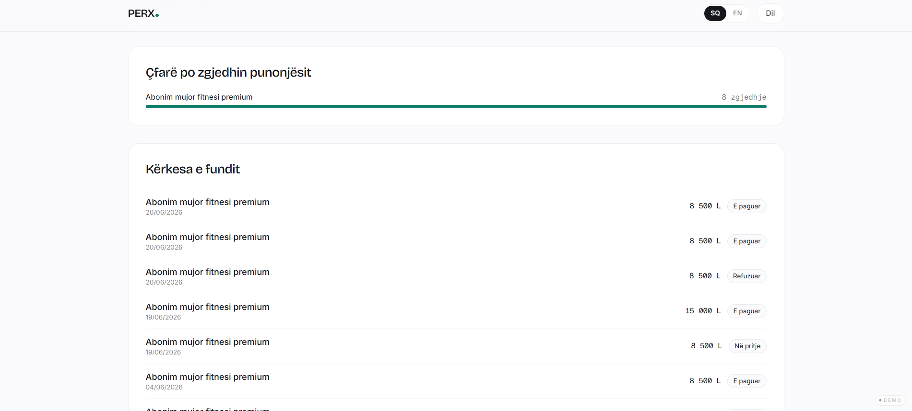

The provider can track:

- Most selected offer
- Number of selections
- Latest requests
- Payment status
- Pending requests
- Rejected requests

---

### Used Tickets

Providers can view ticket redemption history.

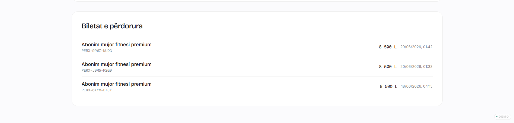

Each ticket shows:

- Benefit name
- Ticket code
- Value
- Date and time

Example ticket codes:

```txt
PERX-99WZ-NUDG
PERX-J9M5-M2G9
PERX-6XYM-D7JY
```

---

### Ticket Verification

Providers can verify benefits by scanning the QR code or typing the code manually.


Verification methods:

1. Scan the employee QR ticket.
2. Enter the manual ticket code.

Example code format:

```txt
PERX-XXXX-XXXX
```

---

## Recommended Demo Flow

For judges, use this flow:

1. Open the landing page.
2. Explain the problem: employee benefits are often generic and underused.
3. Show login and role selection.
4. Enter the employee dashboard.
5. Show the employee balance and spending progress.
6. Open new offers.
7. Open the marketplace.
8. Show smart packages.
9. Open an offer detail modal.
10. Explain the tax-saving preview.
11. Open the AI concierge.
12. Ask for benefits for energy and focus.
13. Show the AI-generated package.
14. Show package location details.
15. Open the map view.
16. Open My Benefits.
17. Show the QR ticket.
18. Show gift points and gift package flows.
19. Switch to employer.
20. Show budget, approvals, team management, analytics, and savings.
21. Switch to provider.
22. Show provider dashboard, demand, used tickets, and QR verification.
23. Close by explaining how PERX connects employees, employers, and providers in one marketplace.

---

## Current MVP Scope

This is a hackathon MVP. The current version is focused on demonstrating the product experience and the business model.

Included in the MVP:

- Landing page
- Authentication UI
- Role-based demo flows
- Employee dashboard
- Marketplace
- Smart packages
- AI concierge
- Tax-saving explanation
- Map view
- QR tickets
- Employee gifting
- Employer dashboard
- Employer team management
- Employer analytics
- Provider dashboard
- Provider ticket scanning
- Bilingual UI toggle

Some data is demo/preloaded data for presentation.

---

## Future Improvements

Future versions could include:

- Production authentication rules
- Full employer onboarding
- Full provider onboarding
- Real payment and billing system
- Provider payout management
- Real QR scanner mobile app
- Real-time analytics
- Payroll integration
- TeamSystem integration
- Multi-country tax rules
- More advanced AI recommendations
- Approval workflows by department
- Employee preference onboarding
- Admin dashboard
- Security hardening
- Audit logs

---

## Useful Commands

```bash
npm install
npm run dev
npm run build
npm run preview
npm run lint
npm run format
```

Note: `npm run build` is the important command for demo deployment. `npm run lint` may report formatting issues from generated/demo code and is not required to run the app.

---

## License

Hackathon demo project.
